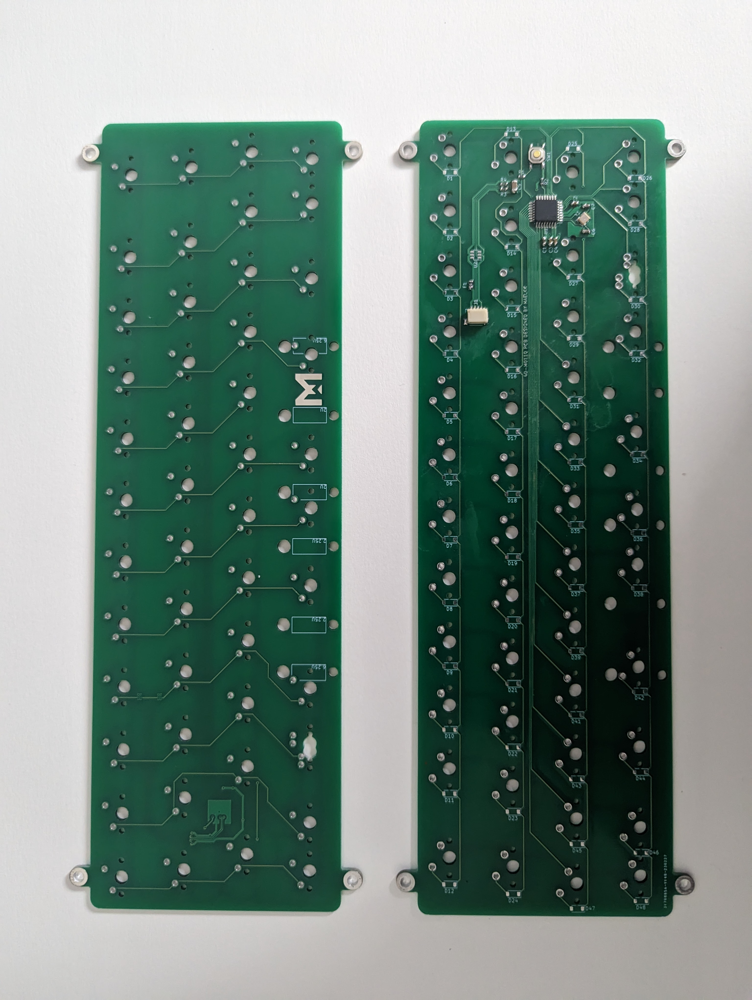
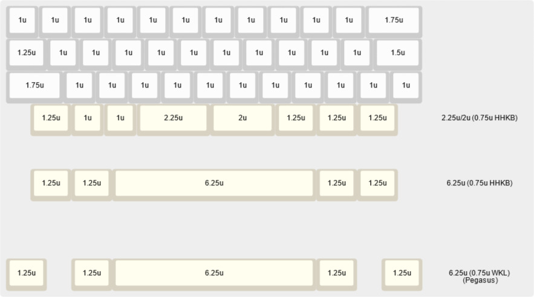

# 40-m0110 PCB
 
An OpenSource 40% PCB compatible with Ani's 40-m0110 case.  
Made for the Indian Mechanical Keyboard Community. 

## Layouts Supported  

## Firmware

### Building the firmware
Copy the folder "40m0110" from the firmware folder to your qmk_firmware/buildakb folder  
Launch QMK MSYS and run: `qmk compile -kb buildakb\40m0110 -km via`  
The firmware file will be created in qmk_firmware/.build folder  

### Flashing the firmware
Launch QMK Toolbox, Select MCU as ATmega32U2, select the firmware file and enable Auto-Flash checkbox.  
Press the reset button on the PCB to put the PCB in Bootloader mode.  
